# AI Agent Challenge - Bank Statement Parser Generator

## 📖 Overview

This project implements an autonomous AI agent that automatically generates custom bank statement parsers from PDF files. The system uses Google's Gemini AI to analyze sample bank statements and create Python parsers that can extract transaction data with high accuracy.

## ✨ Features

- **Autonomous Parser Generation**: AI-powered creation of custom parsers for different banks
- **Self-Correcting Loop**: Up to 3 refinement attempts with error feedback
- **Multi-Bank Support**: Works with ICICI, SBI, HDFC, and other banks
- **Validation System**: Compares parsed results against reference CSVs
- **Extensible Architecture**: Easy to add new bank formats

## 🛠️ Installation

### Prerequisites
- Python 3.8 or higher
- pip (Python package manager)

### Setup

1. Clone the repository:
```bash
git clone https://github.com/your-username/ai-agent-challenge.git
cd ai-agent-challenge
```

2. Install required dependencies:
```bash
pip install pandas pytest pdfplumber google.generativeai
```

## 🔑 API Configuration

1. Get a Gemini API key from [Google AI Studio](https://aistudio.google.com/)
2. Set your API key:
```bash
 GEMINI_API_KEY="your_actual_api_key_here"
```
3. Alternatively, you can set the key directly in the code (not recommended for production):
```python
# In agent.py
GEMINI_API_KEY = "your_actual_api_key_here"
```

## 🚀 Usage

### Generating a Parser

To generate a parser for a specific bank:

```bash
python agent.py --target <bank_name>
```

Example for ICICI Bank:
```bash
python agent.py --target icici
```

This will:
1. Read the sample PDF from `data/icici/icici_sample.pdf`
2. Read the reference CSV from `data/icici/icici_sample.csv`
3. Generate a parser at `custom_parsers/icici_parser.py`
4. Test the parser against the reference data

### Testing the Parser

Run the test suite to verify parser accuracy:

```bash
pytest test_parser.py 
```

## 🤖 How It Works

The agent follows a sophisticated workflow:

1. **Extraction**: Reads sample PDF and CSV files for the target bank
2. **Analysis**: Uses Gemini AI to understand the bank statement format
3. **Code Generation**: Creates a custom parser Python script
4. **Testing**: Validates the parser against the reference CSV
5. **Refinement**: Iteratively improves the parser (up to 3 attempts)

```mermaid
flowchart TD
    A[Extract PDF + CSV] --> B[Analyze Statement Format]
    B --> C[Generate Parser Code with Gemini]
    C --> D[Test Parser vs Reference CSV]
    D -->|Success| E[Save Parser ✅]
    D -->|Failure| F[Refine Approach]
    F --> B
```



## 🧪 Adding New Banks

To add support for a new bank:

1. Create a directory in `data/` with the bank's name
2. Add a sample PDF statement as `[bank]_sample.pdf`
3. Add a corresponding CSV with the expected parsed data as `[bank]_sample.csv`
4. Run the agent with the new bank name

## 📊 Output Format

Parsed data includes:
- Transaction date
- Description/Narration
- Withdrawal amount
- Deposit amount
- Balance
- Reference number


